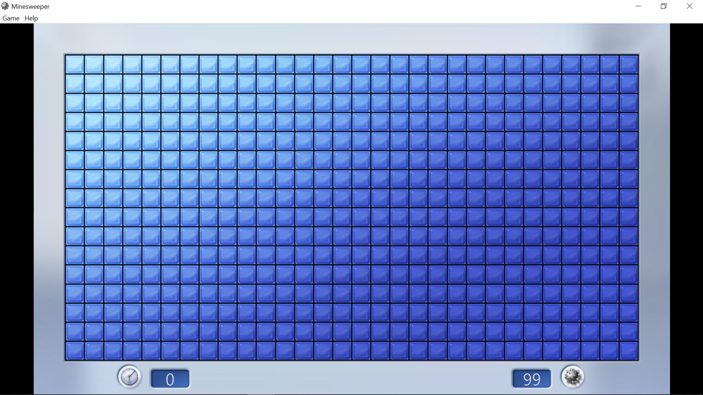
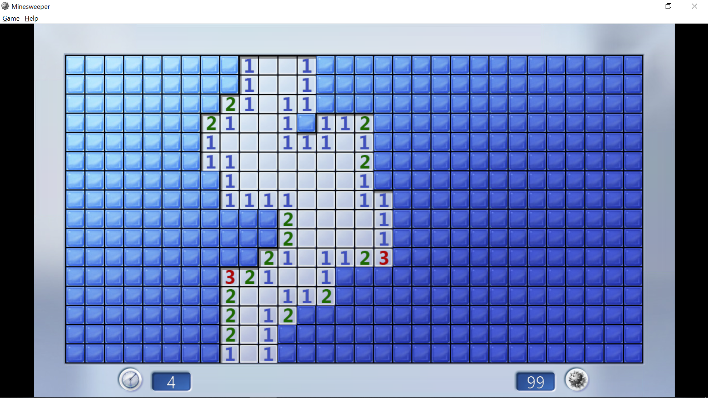
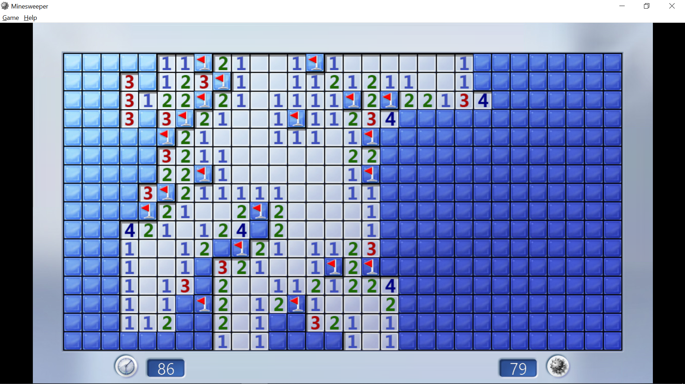
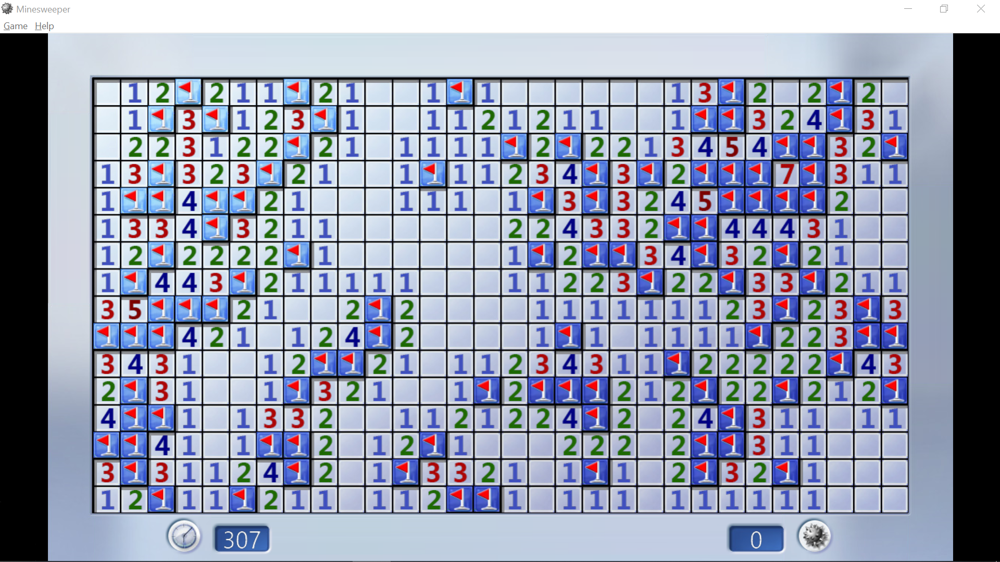

# Reduction from Minesweeper to All-Solutions Boolean Satisfiability Problem

__Group members__: Christopher Du, Iris Liu, Iman Moreira, Juniper Parsons, Zibing Zhang

This post will describe the reduction of playing* a game of [Minesweeper](https://en.wikipedia.org/wiki/Minesweeper_(video_game)) to solving the all-solution [Boolean satisfiability problem](https://en.wikipedia.org/wiki/Boolean_satisfiability_problem) (AllSAT).

*It is important to realize that Minesweeper is not a game with [perfect information](https://en.wikipedia.org/wiki/Perfect_information), while SAT _is_ a "game" with perfect information.
Therefore it is not exactly possible to reduce the playing of Minesweeper to solving ALLSAT.
However, for each individual move, it _is_ possible to reduce that decision problem to ALLSAT.

# What is Minesweeper?

Minesweeper is a single-player, puzzle video game in which the player has to "clear" the board without detonating any of the bombs.

This post will focus on the version of Minesweeper that was bundled with Windows 7.
For anyone interested in playing the game, an installation can be found [here](https://minesweepergame.com/download/windows-7-minesweeper.php).
Another version of the game can also be found online [here](https://minesweeper.online/).

## How to Play

<!--  -->

The goal of the game is to clear the entire board without detonating any bombs.
After the first move, an area of the board is initially cleared.
Inset tiles have been cleared, while raised tiles have yet to be cleared, or may contain bombs underneath.
The number displayed on a cleared tile indicates the total number of bombs on its adjacent tiles.
Blank tiles are not surrounded by any tiles.

The player is able to flag tiles they believe to contain a bomb.
The player must methodically click on raised tiles to clear them.

The game is over once all tiles that do not contain bombs have been cleared, or once the player clears a tile that contains a bomb.

# What is the Boolean satisfiability problem (SAT)?

For any Boolean formula, the Boolean satisfiability problem is the problem of determining if there exists an assignment of the Boolean variables such that the formula evaluates to TRUE.
SAT is famously known to be NP-complete.

Developing state-of-the-art SAT solvers is an active area of research.
Most modern solvers rely on assortment of techniques such as conflict-driven-clause-learning and the Davis-Putnam algorithm.

# Minesweeper Strategies

There are two basic strategies that can be used to progress the game to an advanced state.
Eventually, we must rely on a reduction to ALLSAT to progress further into the game.

## Basic Strategies

Consider the situation above which occurs in the upper right hand corner.

### Basic Strategy 1: Flag "Obvious" Cells

The cell in the upper right hand corner indicates that there is exactly 1 mine in its adjacent cells.
Since there is only 1 uncovered adjacent cell, the uncovered cell must be the mine, and so we can flag that cell.

### Basic Strategy 2: Reveal "Obvious" Cells

The cell to the left of the cell in the upper right hand corner indicates that there is exactly 1 mine it its adjacent cells.
Since we know the cell below it must be a mine, all other surrounding cells can safely be uncovered.

## 1-2-1 Pattern

The 1-2-1 pattern is a very common pattern.
Most players should know immediately that the solution is to flag cells $x_2$ and $x_4$.
We will show how we can deduce this solution using SAT.

### Reduction to SAT

For the simplicity of the reduction, we will only focus on the middle three cells.
For each cell, we will use their surrounding, uncovered cells to create a boolean expression that describes their relationship with each other.
Finally, we will combine the three expressions into a single expression and apply SAT on the combined expression.

Each cell is labeled with a boolean variable, $x_i$, that is TRUE if it covers a bomb and is FALSE otherwise.

Consider the second cell from the top.
We know that exactly one of $x_1$, $x_2$, and $x_3$ must be TRUE.
This can be modeled with the following boolean expression.

$$TODO$$

Consider the third cell from the top.
We know that exactly two of $x_2$, $x_3$, and $x_4$ must be TRUE.
This can be modeled with the following boolean expression.

$$TODO$$

It is clear that the fourth cell from the top mirrors the second cell from the top.
Combining the three boolean expressions for the middle three cells, we have the combined boolean expression.

Running the expression through a SAT-solver, we can see that $x_2$ and $x_4$ being assigned TRUE with everything else assigned FALSE is a satisfying assignment.

TODO: talk about ALLSAT, how multiple solutions creates ambiguity, but how we can use number of solutions as a heuristic as to how to proceed in the game

# Further Readings

- [Wikipedia Minesweeper Article](https://en.wikipedia.org/wiki/Minesweeper_(video_game))
- [Wikipedia Boolean Satisfiability Problem Article](https://en.wikipedia.org/wiki/Boolean_satisfiability_problem)
